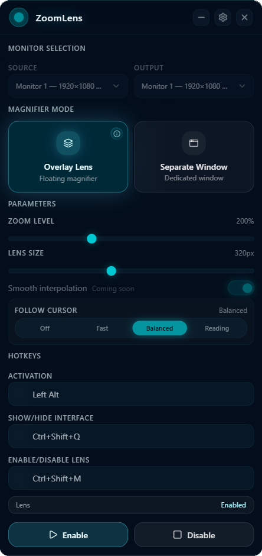
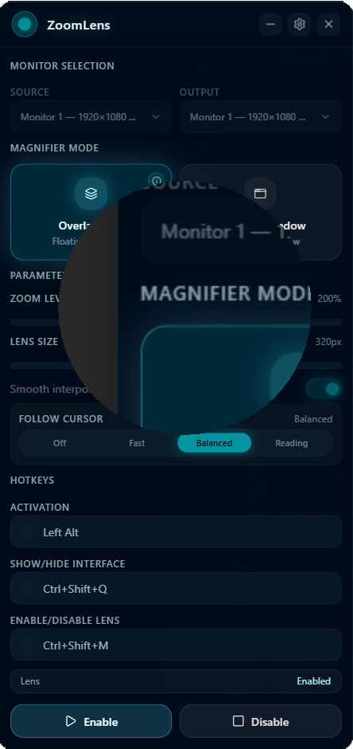
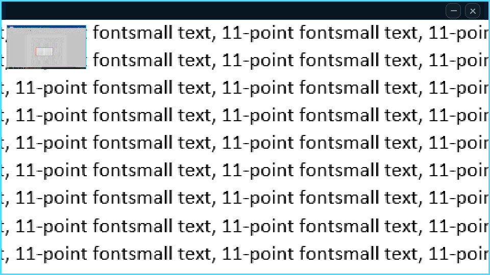
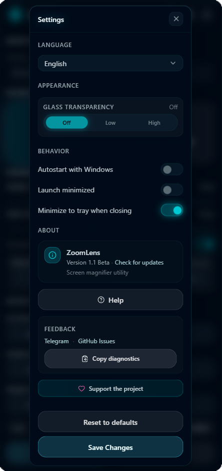

# ZoomLens

🇬🇧 English | 🇷🇺 [Русский](README_RU.md)

**ZoomLens** is a desktop screen magnifier for Windows.

It provides a floating magnifier lens or a separate zoom window that can help with reading small UI elements, checking details on screen, or focusing on a specific area during work or gaming.

> ZoomLens 1.1 Beta is an early public build. Some limitations are expected.

## Download

Latest portable release:

https://github.com/ZoomLensApp/ZoomLens/releases/latest

ZoomLens is distributed as a portable ZIP package. No installer is required for this beta version.

## Screenshots

### Main Window

### Overlay Lens

### Separate Window

### Settings

## Features

* Overlay Lens mode — a circular magnifier over the screen
* Separate Window mode — a movable zoom window with navigator
* Source and output monitor selection
* Follow Cursor modes
* Global hotkeys
* Compact control panel
* English and Russian interface
* Portable local configuration via `config.ini`

## How to use

1. Download the portable ZIP from Releases.
2. Extract it to any folder.
3. Run `ZoomLens.exe`.
4. Adjust magnifier settings in the control panel.
5. Use **Save Changes** to keep your settings.

## Privacy

ZoomLens works locally on your computer.

It does not collect telemetry, record your screen, take screenshots, or send screen contents anywhere.

More details: [PRIVACY.md](PRIVACY.md)

## Known limitations

* This is a beta release.
* The app is currently unsigned, so Windows SmartScreen may show a warning.
* Some fullscreen games may hide or block overlays.
* Borderless windowed mode usually works better than exclusive fullscreen.
* Separate Window mode works best with two monitors.
* If Windows display scaling is changed while ZoomLens is running, restart ZoomLens.
* Changing monitor topology while ZoomLens is running may require restarting the app.
* Smooth interpolation is planned for a future engine version.
* Image clarity depends on the source resolution and scaling.

## Games and anti-cheat note

ZoomLens does not inject into games. It uses standard Windows windowing and magnification APIs.

However, some games, fullscreen modes, or anti-cheat systems may block overlays or behave differently. Use ZoomLens with competitive games at your own discretion.

## Feedback

Found a bug or have an idea?

Please open an issue here:

https://github.com/ZoomLensApp/ZoomLens/issues

When reporting a problem, it helps to include:

* Windows version
* Number of monitors
* DPI / scaling settings
* ZoomLens mode used
* Steps to reproduce the issue
* Diagnostics copied from the app, if available

## Updates

Telegram channel:

https://t.me/ZoomLensApp

## Support the project

ZoomLens is developed independently and remains free to use.

If it helps you, you can support future development by starring the project on GitHub.

Other support options are available inside the app.

## Author

Independent project by **Petr Volynets**.
